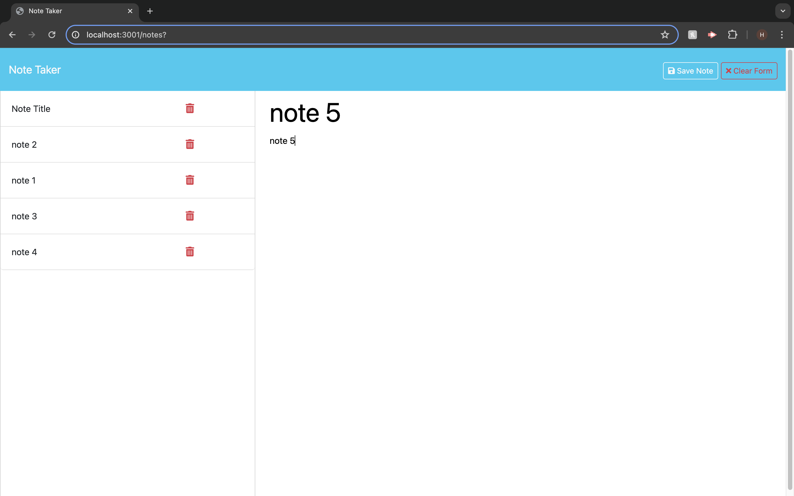

# JotSpot
    

## Description

A simple and efficient note-taking application built with Express.js. It allows users to write, save, and manage their notes seamlessly. The backend is powered by Express.js, and the notes data is stored in a JSON file, making it easy to deploy and manage.

## Deployed Application URL

[JotSpot](https://jotspot-bf8s.onrender.com/notes)

## Table of Contents
* [Installation](#installation)
* [Usage](#usage)
* [Credits](#credits)
* [Features](#features)
* [Dependencies](#dependencies)
* [Screenshots](#screenshots)
* [How to Contribute](#how-to-contribute)
* [Tests](#tests)
* [License](#license)

## Installation

1. run 'npm init -y'
2. install dependencies with 'npm i'

## Usage

To use this application, follow these steps:

1. Install dependencies: Run 'npm init -y' followed by 'npm i' to install the required dependencies.
2. Open the 'Notes' page by pressing the 'Get Started' button
3. Follow the prompts: fill out your note title, as well as the body
4. Press save to add your note to the list in the left column
5. if you want to delete a note after it has been created, press the red trashcan

## Credits

[Xander Rapstine](https://github.com/Xandromus)
[John McCambridge](https://github.com/nol166)
[George](https://github.com/Georgeyoox)

## Features

1. Create Notes:
    - Users can create new notes with a title and body.
    - Notes are saved persistently in a JSON file on the server.

2. View Notes:
    - Users can view a list of all saved notes.
    - Clicking on a note displays its full content.

3. Delete Notes:
    - Users can delete notes they no longer need.
    - The note list updates dynamically to reflect the changes.

## Dependencies

- node project manager
- express: 4.16.4

## Screenshots

## How to Contribute

If you would like to contribute you can contact me [Via Email](mailto:harrismhurley@icloud.com?subject=[GitHub]%20Dev%20Connect) or visit [github](https://github.com/harrismhurley).

## Tests

N/A

## License 

This project is licensed under the [MIT](https://opensource.org/licenses/MIT) license.
